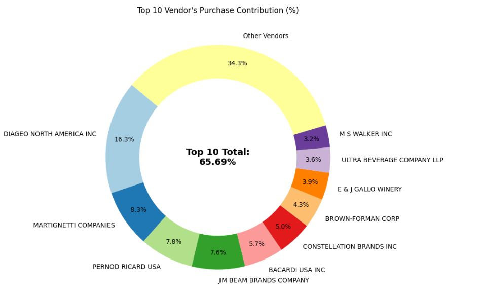

# Vendor Performance Analysis

This project focuses on analyzing **vendor performance in the liquor industry**. The industry is vast, with multiple vendors working with numerous brands. The business model primarily revolves around **bulk purchasing from vendors** and **reselling to customers**, with profitability driven by sales margins, inventory efficiency, and freight management.  

This analysis uncovers **critical insights** about vendor performance, profitability, and areas for improvement.  

Insights and recommendations are provided on the following key areas:
- Top-performing vendors and brands.  
- Potential brands with high profitability but low sales.  
- Contribution of top vendors to overall market performance.  
- Impact of bulk purchasing on per-unit cost.  
  
**Python notebooks** – [click here](notebooks)

**Excel Preliminary Report** – [click here](excel_report)

**Interactive Power BI Dashboard** – [click here](powerbi_dashboard)

---

## Data Structure and Initial Checks

The dataset consists of **6 tables**, but only 4 are relevant for the scope of this analysis:  
- `purchase_prices`  
- `purchases`  
- `sales`  
- `vendor_invoice`  

The main fact table is **purchases**, with **2,372,474 records**.  

**Entity Relationship Diagram (ERD)**  
 

### Data Cleaning & Preparation
Before starting the analysis, several checks and fixes were performed:
- Corrected improper data types in some columns.  
- Handled NULL values appropriately.  
- Fixed typos and spelling errors in vendor names.  
- Identified and flagged outliers.  

---

## Executive Summary

### Overview of Findings
- **High vendor concentration:** The top 10 vendors account for more than **70% of total sales**.  
- **High-margin underperformers:** Several brands with **profit margins >90% but sales < $200K** represent untapped growth opportunities.  
- **Bulk purchase efficiency:** Large order sizes significantly reduce unit costs, improving margins.  

**Dashboard Preview** 
 

  

---

## Insights Deep Dive

### 1. Top Vendors and Brands
- **Diageo North America Inc** leads with the highest sales volume (~$69M).  
- Top 10 vendors contribute ~70% of total sales, showing **heavy reliance on a few key players**.  
- Brand-level analysis highlights which brands are driving growth across the industry.  

---

### 2. Underperforming Brands
- Identified brands with **very low sales (<$200K)** but **extremely high profit margins (>90%)**.  
- These are **high-potential underperformers** – ideal targets for promotional campaigns.  
- Increasing their market share could lead to substantial profit growth.  

---

### 3. Impact of Bulk Purchasing on Unit Cost
- Vendors buying in bulk achieve the **lowest average unit price ($10.78/unit)**.  
- The difference between small and large orders is ~**72% reduction in unit cost**.  
- This confirms that **bulk pricing strategies encourage larger purchases**, boosting total sales even with lower per-unit revenue.  

 

---

## Recommendations
- **Promote underperforming brands** through campaigns: targeted advertising, pricing strategies, and discounts.  
- **Diversify reliance on vendors**: uplift smaller vendors to reduce overdependence on the top 10.  
- **Negotiate freight contracts for bulk orders** to maximize profit margins.  

---

## Assumptions & Caveats
- Missing freight values were treated as 0 (assumed freight waived).  
- Extreme turnover values (>100x) were included but flagged as outliers.  
- Data represents a **single period** – seasonal/promotional variations are not reflected.  
- All values standardized to **USD**.  

---

## Project Artifacts
- **Python notebooks**  – [click here](notebooks)  
- **Excel preliminary dashboard** – [click here](excel_report)  
- **Power BI executive dashboard** – [click here](powerbi_dashboard)  

---

## Dashboard Snapshots
### Excel Preliminary Report 
  

### Power BI Executive Dashboard  
  
